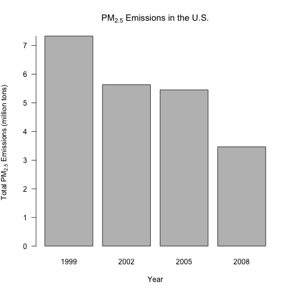
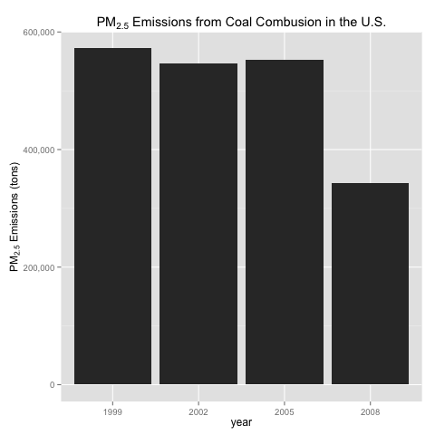

# Particulate Matter Course Project

## Introduction

Fine particulate matter (PM_{2.5}) is an ambient air pollutant for which
there is strong evidence that it is harmful to human health. In the
United States, the Environmental Protection Agency (EPA) is tasked
with setting national ambient air quality standards for fine PM and
for tracking the emissions of this pollutant into the
atmosphere. Approximatly every 3 years, the EPA releases its database
on emissions of PM_{2.5}. This database is known as the National
Emissions Inventory (NEI). You can read more information about the NEI
at the 
[EPA National Emissions Inventory web site](http://www.epa.gov/ttn/chief/eiinformation.html).

For each year and for each type of PM source, the NEI records how many
tons of PM_{2.5} were emitted from that source over the course of the
entire year. The data used in this assignment are from 1999, 2002,
2005, and 2008, and are available [here](https://d396qusza40orc.cloudfront.net/exdata%252Fdata%252FNEI_data.zip).

## Research questions

### Question 1

*Have total emissions from PM2.5 decreased in the United
States from 1999 to 2008?*

The following plot shows total PM_{2.5} emissions from all sources in
the U.S., and show a substantial decrease over the course of the
evsurvey.  PM_{2.5} emissions in 2008 were approximately half of their
1999 level.

 

### Question 2

*Have total emissions from PM_{2.5} decreased in the Baltimore City,
Maryland from 1999 to 2008?*

The following plot shows PM_{2.5} emissions from all sources in the
city of Baltimore only.  This is done by filtering data on the
location code ("24510") that corresponds to the city of Baltimore.
The data show a downward trend, though it is not smoothly downward, as
emissions increase in 2005.

 

### Question 3

*Of the four types of sources indicated by the type (point, nonpoint,
onroad, nonroad) variable, which of these four sources have seen
decreases in emissions from 1999–2008 for Baltimore City?*

The following plot shows PM_{2.5} emissions by source, restricted to
the city of Baltimore (location code "24510").  In the plot below,
each of the four sources is shown in its own sub-chart.  The overall
trend in non-road, nonpoint, and on-road emissions is downward.  Point
source emissions are approximately the same at the start and end of
the data, but saw a substantial upward trend during the survey period.

 

### Question 4

*Across the United States, how have emissions from coal
combustion-related sources changed from 1999–2008?*

The following plot shows PM_{2.5} emissions from coal combustion.  In
the data, each of the pollution sources in the data is identified with
a source code, and only the pollution sources identified with a sector
name containing the word "coal" were matched.  Once the coal
combustion sources were identified, a plot similar to that in question
1 was generated.  The data show that coal-related PM_{2.5} emissions
decreased over the measurement period.

### Question 5

*How have emissions from motor vehicle sources changed from 1999–2008
in Baltimore City?*

The following plot shows motor-vehicle PM_{2.5} emissions in
Baltimore.  To analyze only motor vehicles, only on-road emission data
is analyzed.  To show only Baltimore, the location code "24510" is
used as a filter.

### Question 6

*Compare emissions from motor vehicle sources in Baltimore City with
emissions from motor vehicle sources in Los Angeles County,
California. Which city has seen greater changes over time in motor
vehicle emissions?*

To answer this question, it is not sufficient to look only at the
absolute levels of PM_{2.5} emissions.  Los Angeles is a much larger
city than Baltimore, and therefore, will see much larger changes in
the absolute level of emissions.  Therefore, the following plot shows
both the absolute level of emissions in Baltimore and Los Angeles, and
then shows the relative change by "normalizing" the totals so that
they are displayed relative to their maximum.

